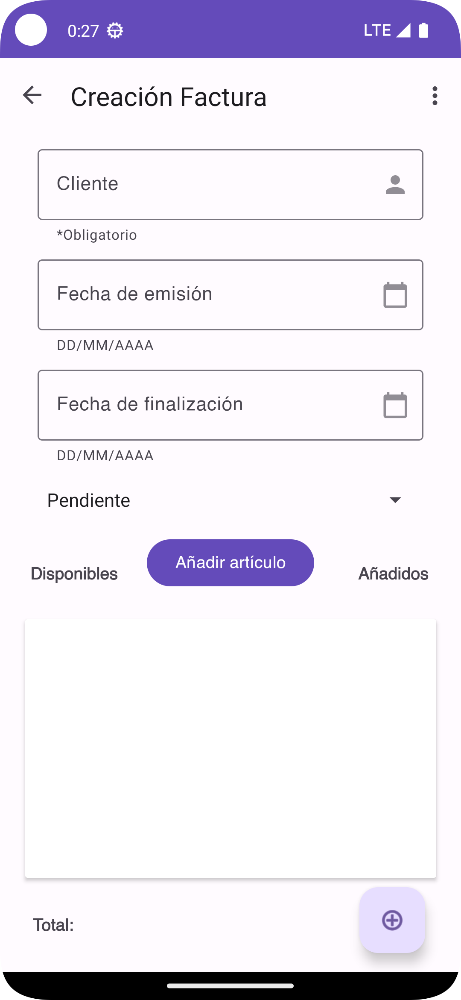
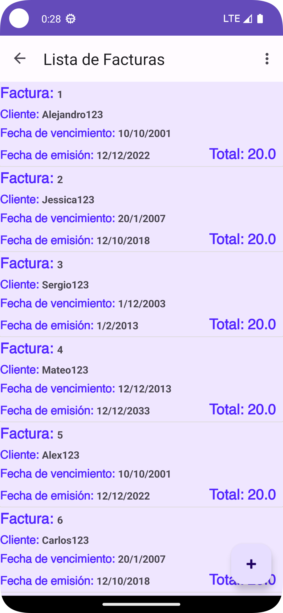
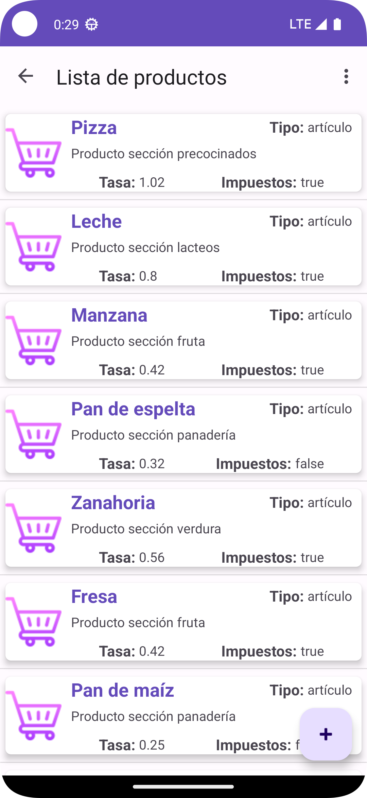

Inovice es la aplicación que se realizará de manera modular para el estudio de todo el temario de ✨DEINT.✨

## Características

- Aplicación que se ha desarrollado con módulos dinámicos
- Nevagación a Fragment de forma directa

## V1.0

## V2.0 (29/10/2023)
 - Se ha quitado carpetas del proyecto innecesarios en GitHub
 - Se ha añadido fichero README.md con las mejoreas de la versión 2.0
 - Se ha modificado la actividad y el fragmento principal <code>MainFragemnt</code> que contiene dos botones que nos mostrarán el <code>Sign In</code> y el registro <code>Sign Up</code>
## V2.1 (29/10/2023)
 - Se ha estructurado la aplicación para simplicar la programación en Kotlin
 - Error en la estructura de las carpetas Theme (Gracias Carlos Bocka)

 --------------------------------------------------------------------------------------------------
 Escrito por CBO121311
 
 ## V2.3.1 (01/11/2023)
 - Se ha añadido el icono e insertado el tema principal.
 - Se añadió las tres layout tanto de customer como de task
 - Se ha añadido los 12 botones y el navgraph correspondiente para acceder a las distintas layout.

 --------------------------------------------------------------------------------------------------
 Escrito por SergioGV98

 ## V2.3.5 (02/11/2023)
 - Se ha agregado un RadioGroup para los botones.
 - Se ha cambiado el layout de Task_detail de RelativeLayout a LinearLayout.
 - Se ha agregado mejoras en la interfaz de task_detail. Tanto colores como imágenes.
 - Se ha añadido temporalmente una imagen al proyecto de placeholder para task_detail.
 - Se ha agregado el código necesario para que al entrar en la lista de tareas se muestren unas tareas creadas.
 - Renombramiento de las carpetas principales de tareas.
 - Cambios en el nav_graph para poder navegar correctamente.
   
--------------------------------------------------------------------------------------------------
 Escrito por CBO121311
 
 ## V2.3.9 (02/11/2023)
 - Implementado el resto de layouts.
 - Corrección menores a los módulos customer.

 --------------------------------------------------------------------------------------------------
 Escrito por SergioGV98
 
 ## V2.4.1 (04/11/2023)
 - Eliminación de imágenes PlaceHolder.
 - Eliminación de carpetas innecesarias que no se usaban.
 - Creación de dimens.xml en las distintas carpetas de tareas.
 - Creación de styles.xml en las distintas carpetas de tareas.
 - Se ha asignado a cada interfaz su dimens y styles correspondientes.
 - Se ha actualizado la interfaz tasklist (Mejoras visuales).

----------------------------------------------------------------------------------------------------

 Escrito por CBO121311
 
 ## V2.4.2 (06/11/2023)
 - Actualización de las layout customer y mejoras en los xml de los recursos.

 --------------------------------------------------------------------------------------------------
 Escrito por mateotamayoo

 ## V2.4.3 (06/11/2023)
 - Se ha cambiado el layout de invoice_detail.
 - Se ha agregado el código necesario para que al entrar en la lista de facturas se muestren unas facturas creadas.
 - Renombramiento de las carpetas principales de invoice.
 - Cambios en el nav_graph para poder navegar correctamente.
   
--------------------------------------------------------------------------------------------------

 Escrito por CBO121311
 
 ## V2.4.4 (06/11/2023)
 - Añadido botón prueba para el calendario (se eliminará el miercoles).
 - Actualización de los fragment de customer añadiendo binding y utilizando el destroy.

 --------------------------------------------------------------------------------------------------

 Escrito por SergioGV98
 
 ## V2.4.6 (06/11/2023)
 - Añadido la funcionalidad de los botones de agregar fecha en Task create.
 - Añadido a todos los fragments de tareas el destroy para manejar su destrucción.
 - Eliminación de código innecesario.
 - Mejoras generales en las interfaces y cambio de fondo en Task List.

-------------------------------------------------------------------------------------

Escrito por CBO121311

 ## V2.5 (10/11/2023)
 - Versión final de todas las layout.
------------------------

# Icono

# Capas de Layout

## Cliente
|Crear|Detalles|Lista| 
| ------------------------------ | ------------------------------ | ------------------------------ | 
||| |

## Factura
|Crear|Detalles|Lista| 
| ------------------------------ | ------------------------------ | ------------------------------ | 
||| |

## Artículos
|Crear|Detalles|Lista| 
| ------------------------------ | ------------------------------ | ------------------------------ | 
||| |
## Tareas
|Crear|Detalles|Lista| 
| ------------------------------ | ------------------------------ | ------------------------------ | 
||| |
